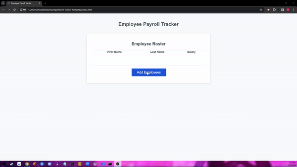
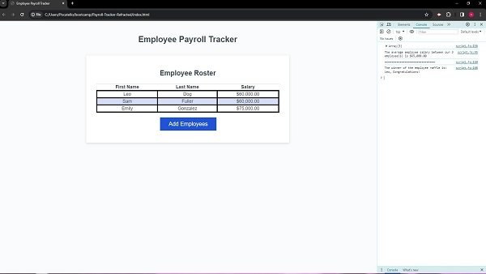

# Payroll Tracker Refracted

## Description

Given a set of code, various altercations and bug fixes were made to allow the user to track employees and their salaries. Numerous JavaScript elements were used to achieve this goal, such as: while loops, objects, arrays, if/else statements, and for loops. The result is a comprehensive webpage that utilizes the coder's knowledge of Javascript.

## Usage

After clicking the "Add Employees" button, the user is prompted to enter their employee's first name, last name, and salary. The user will then be prompted on whether or not they would like to enter another employee, repeating this cycle. Once finished the employee(s) and their details will be displayed on screen, and the average salary amongst the employee(s), as well as a randomly selected employee, is displayed in the console log.

Prompt Features:

Console Features:

## Credits

Base code provided by UCI Virtual Bootcamp

README gif made with ezgif.com

